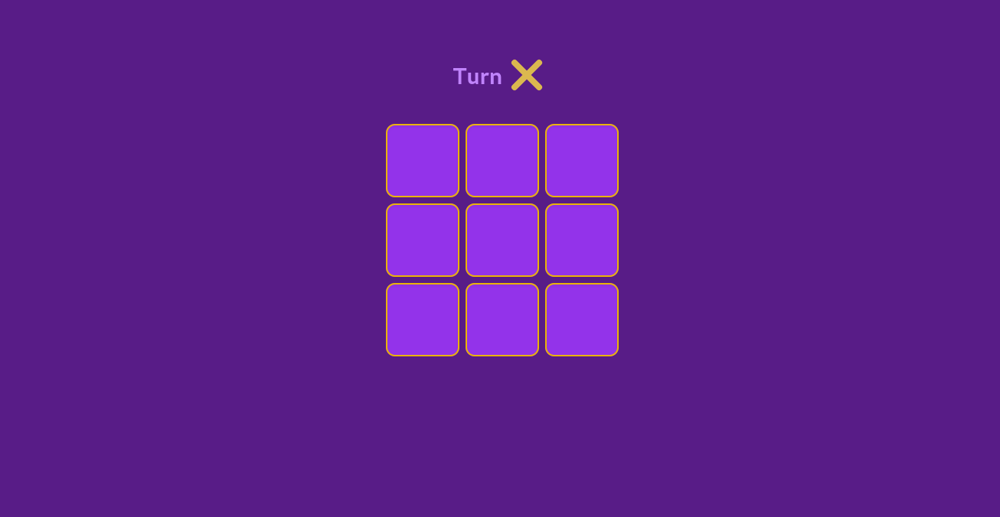
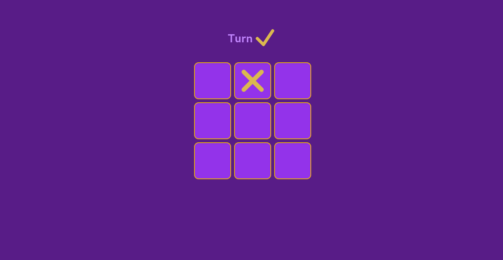
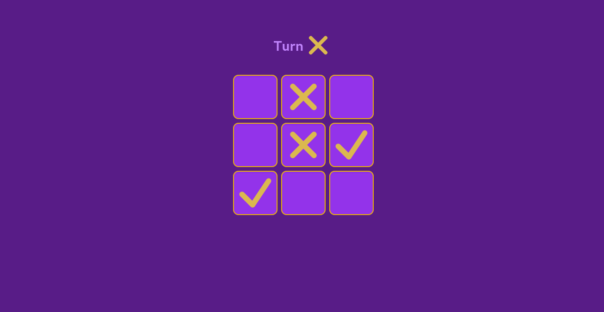
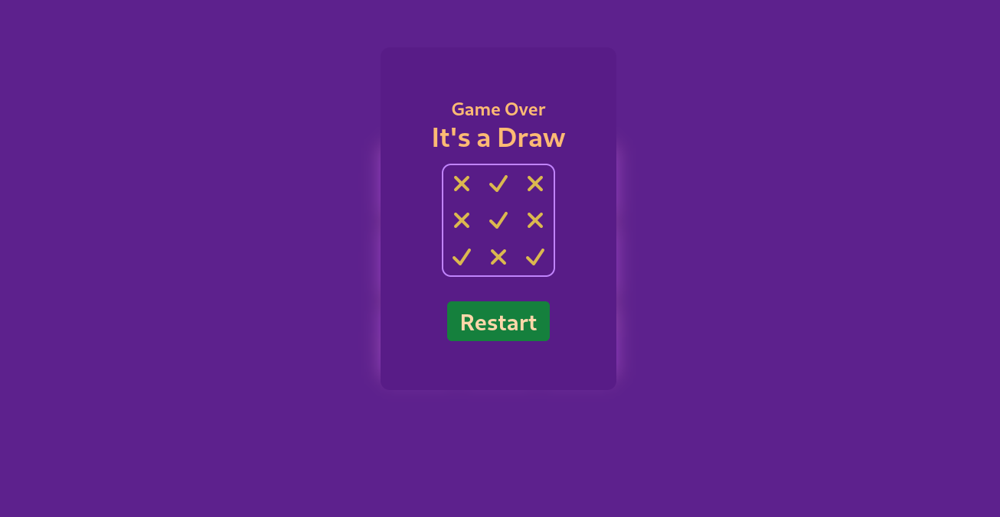

# Tic-Tac-Toe

One page two player game made with JS framework react and styled with CSS framework Tailwind.

---

## Preview images:

 

### Empty Board:

 

 

- This board will be shown after every load and restarting session.

 

### First Turn:

 

 

- First turn will start with cross follwed by tick.

 

### Alternting Turns:

 

 

- Winner will be checked after every inputs.
- Turn will be interchanged after every turn.

 

### Winner Message Modal:

 

 

- After clicking restart game will start again.

 
 

---

## Tech Stack Used:

 

  
  

  

---

## Link of deployed app:

TBA

---

## Profiles:
